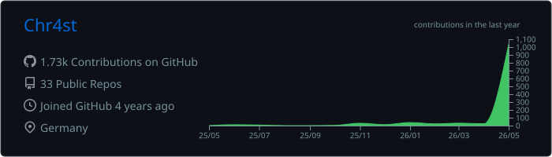
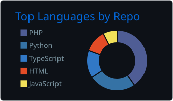
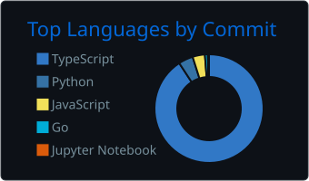
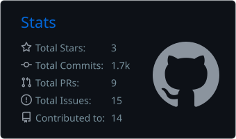
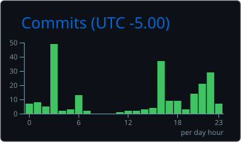

# Hi, I'm Christ

Math, CS & Statistics @ University of Michigan | Freshman | Retired web dev (saved from JS)

Interested in ML research and distributed systems. Background in PHP plugin architecture, database management, and networked systems. Check out [Nightfall MCPE](https://github.com/Nightfall-MCPE), a Minecraft server network with custom game infrastructure.

Currently working on symbolic computation, multi-model AI orchestration, and Machine Learning projects.

## Tech Stack

## GitHub Stats

  

  
  

  
  

## Featured Projects

| Project | Description |
|---------|-------------|
| [**conductor**](https://github.com/Chr4st/conductor) | Multi-model AI coding orchestrator — Claude + Gemma + Codex in a Tauri desktop app `Rust` |
| [**Integrals**](https://github.com/Chr4st/Integrals) | ML-powered symbolic integration engine: SymPy-first with Transformer fallback `Python` |
| [**MultiVersion**](https://github.com/Nightfall-MCPE/MultiVersion) | Multi-version protocol support plugin for PocketMine-MP `PHP` |
